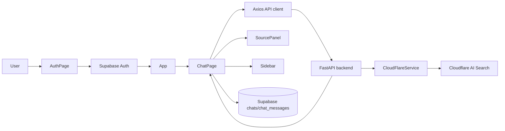

# Architecture

This document describes the current implementation of DocChat as observed in the repository.

## Tech Stack

- Frontend: React 19, Vite, Tailwind CSS, shadcn/ui, Radix UI, Lucide icons
- Auth and chat history: Supabase JavaScript client
- Backend: FastAPI, Uvicorn, Python standard library `urllib`
- Document service: Cloudflare AI Search API
- HTTP client in frontend: Axios

References:
- Frontend bootstrap in [src/main.jsx](../src/main.jsx)
- App shell and auth/session gate in [src/App.jsx](../src/App.jsx)
- Supabase client in [src/lib/supabase.js](../src/lib/supabase.js)
- Axios client in [src/services/api.jsx](../src/services/api.jsx)
- FastAPI app in [backend/app/main.py](../backend/app/main.py)
- Cloudflare service layer in [backend/services/cloudflareser.py](../backend/services/cloudflareser.py)

## Folder Responsibilities

- `src/`: React application source
- `src/components/`: UI components, chat surfaces, and shared primitives
- `src/pages/`: top-level auth and chat pages
- `src/lib/`: shared client utilities such as Supabase and helpers
- `src/services/`: frontend API clients
- `backend/app/`: FastAPI entry point and config
- `backend/routes/`: API route handlers
- `backend/services/`: Cloudflare integration logic

## High-Level Flow

## Core Data Flows

### 1. Auth / Session

1. `src/main.jsx` mounts the React app inside `ThemeProvider`.
2. `src/App.jsx` reads the current Supabase session via `supabase.auth.getSession()` and subscribes to `onAuthStateChange`.
3. If a session exists, `App.jsx` renders `ChatPage`; otherwise it renders `AuthPage`.
4. `AuthPage` uses Supabase email/password auth and OAuth sign-in.

Code references:
- [src/App.jsx](../src/App.jsx)
- [src/pages/AuthPage.jsx](../src/pages/AuthPage.jsx)
- [src/lib/supabase.js](../src/lib/supabase.js)

### 2. Document Upload → Cloudflare Storage/Search

1. The frontend sends the file to `POST /upload` via Axios from `src/services/api.jsx`.
2. `backend/routes/upload.py` writes the file to `backend/app/uploads/`.
3. `CloudFlareService.upload_document()` prepares a multipart request to Cloudflare AI Search `.../items`.
4. The service returns the raw Cloudflare response to the frontend through the FastAPI route.

Code references:
- [src/services/api.jsx](../src/services/api.jsx)
- [src/pages/ChatPage.jsx](../src/pages/ChatPage.jsx)
- [backend/routes/upload.py](../backend/routes/upload.py)
- [backend/services/cloudflareser.py](../backend/services/cloudflareser.py)

### 3. Question → Retrieval → Answer → Citation Rendering

1. `ChatPage` sends the user question to `POST /chat`.
2. `backend/routes/chat.py` passes the message to `CloudFlareService.ask_question()`.
3. The service calls Cloudflare AI Search `.../search` and `.../chat/completions`.
4. The service extracts an answer and normalized source objects.
5. `ChatPage` stores messages in Supabase `chats` and `chat_messages`.
6. `ChatMessages` renders the conversation, and `SourcePanel` renders the active source preview.

Code references:
- [src/pages/ChatPage.jsx](../src/pages/ChatPage.jsx)
- [src/components/ChatMessages.jsx](../src/components/ChatMessages.jsx)
- [src/components/Message.jsx](../src/components/Message.jsx)
- [src/components/SourcePanel.jsx](../src/components/SourcePanel.jsx)
- [backend/routes/chat.py](../backend/routes/chat.py)
- [backend/services/cloudflareser.py](../backend/services/cloudflareser.py)

## API / Route Map

- `GET /` in [backend/app/main.py](../backend/app/main.py): health response
- `POST /chat` in [backend/routes/chat.py](../backend/routes/chat.py): asks Cloudflare-backed question
- `POST /upload` in [backend/routes/upload.py](../backend/routes/upload.py): saves uploaded file locally and returns a status

## Current Responsibilities By Component

- `AuthPage`: auth UI and auth actions
- `ChatPage`: state orchestration for chats, sources, uploads, and persistence
- `Sidebar`: conversation history and user account footer
- `Navbar`: sidebar toggle, theme toggle, and sign-out button
- `ChatInput`: message composer and file attachment launcher
- `ChatMessages`: scrollable message list
- `Message`: single message bubble, citations, and message actions
- `SourcePanel`: source preview list and active source detail

## Known Gaps & Follow-ups

- There is no visible chunking or embedding code in the repository. The docs should not claim a specific chunking strategy or embedding model unless that logic is added later.
- `backend/routes/upload.py` currently stores files locally in `backend/app/uploads/`, even though the UI copy suggests a cloud-backed library.
- `src/components/chatwindow.jsx` appears to be a legacy/demo file and is not part of the main app flow.
- `src/components/api.jsx` is a duplicate Axios client beside the active `src/services/api.jsx`.
- There are several static/demo artifacts in `src/data/chatData.js`, `src/components/UploadBox.jsx`, and `src/components/DocumentCard.jsx` that are not used by the current main route flow.
- `backend/vercel.json` points to `server.js`, but the backend code in this repository is Python/FastAPI, not a Node server entrypoint.
- The backend CORS configuration currently reads a single `VERCEL_FRONTEND_URL` environment variable and a fixed localhost allowlist.

